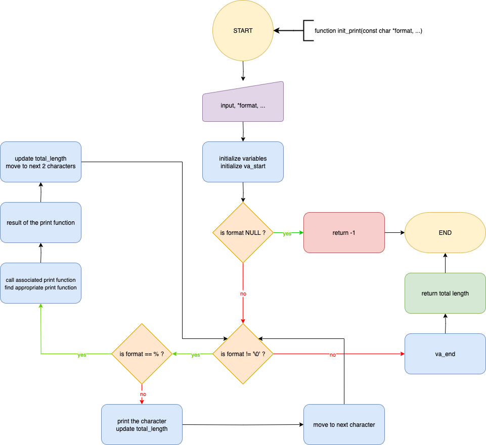

# C - printf

## Table of contents

<details>
	<summary>
		CLICK TO ENLARGE 😇
	</summary>
	<a href="#description">Description</a>
	<br>
	<a href="#objectives">Objectives</a>
	<br>
	<a href="#requirements">Requirements</a>
	<br>
	<a href="#instructions">Instructions</a>
	<br>
	<a href="#tech-stack">Tech stack</a>
	<br>
	<a href="#files-description">Files description</a>
	<br>
	<a href="#installation_and_how_to_use">Installation and how to use</a>
	<br>
	<a href="#thanks">Thanks</a>
	<br>
	<a href="#authors">Authors</a>
</details>

## <span id="description">Description</span>

This project is a recreation of the C library function `printf`, developed as part of the Holberton School curriculum.  
It aims to handle formatted output to the standard output stream using only low-level system calls, while respecting strict constraints.

<table>
    <tr valign="top">
        <td align="center">
            <picture>
                <source media="(prefers-color-scheme: dark)" srcset="./assets/images/printf_flowchart-dark.webp">
                <source media="(prefers-color-scheme: light)" srcset="./assets/images/printf_flowchart-light.webp">
                
            </picture>
        </td>
    </tr>
</table>

## <span id="objectives">Objectives</span>

At the end of this project, I should be able to explain to anyone, **without the help of Google**:

- How variadic functions work in C.
- How the `va_list`, `va_start`, `va_arg`, and `va_end` macros are used.
- The difference between low-level and high-level output functions.
- How to structure a large C project with multiple files and headers.
- How to manage group projects and pair programming effectively.
- How to write and use a custom `man` page.

## <span id="requirements">Requirements</span>

- My programs and functions will be compiled with `gcc` using the flags `-Wall`, `-Werror`, `-Wextra`, `-pedantic` and `-std=gnu89`.
- All my files should end with a new line.
- My code should use the Betty style. It will be checked using [betty-style.pl](https://github.com/hs-hq/Betty/blob/main/betty-style.pl) and [betty-doc.pl](https://github.com/hs-hq/Betty/blob/main/betty-doc.pl).
- I am not allowed to use global variables.
- No more than 5 functions per file.
- The prototypes of all my functions should be included in my header file called `main.h`.
- All my header files should be include guarded.

<details>
    <summary>
        List of allowed functions and system calls.
    </summary>

- `write` (man 2 write)
- `malloc` (man 3 malloc)
- `free` (man 3 free)
- `va_start` (man 3 va_start)
- `va_end` (man 3 va_end)
- `va_copy` (man 3 va_copy)
- `va_arg` (man 3 va_arg)

</details>

## <span id="instructions">Instructions</span>

### Mandatory

<details>
	<summary>
		<b>0. I'm not going anywhere. You can print that wherever you want to. I'm here and I'm a Spur for life</b>
	</summary>
	<br>

Write a function that produces output according to a format.

- Prototype: `int _printf(const char *format, ...);`.
- Returns: the number of characters printed (excluding the null byte used to end output to strings).
- Write output to stdout, the standard output stream.
- `format` is a character string. The format string is composed of zero or more directives. See `man 3 printf` for more detail. You need to handle the following conversion specifiers:
	- `c`
	- `s`
	- `%`
- You don’t have to reproduce the buffer handling of the C library `printf` function.
- You don’t have to handle the flag characters.
- You don’t have to handle field width.
- You don’t have to handle precision.
- You don’t have to handle the length modifiers.

#
**Repo:**
- GitHub repository: `holbertonschool-printf`.
<hr>
</details>

<details>
	<summary>
		<b>1. Education is when you read the fine print. Experience is what you get if you don't</b>
	</summary>
	<br>

Handle the following conversion specifiers:

- `d`
- `i`
- You don’t have to handle the flag characters.
- You don’t have to handle field width.
- You don’t have to handle precision.
- You don’t have to handle the length modifiers.

#
**Repo:**
- GitHub repository: `holbertonschool-printf`.
<hr>
</details>

<details>
	<summary>
		<b>2. Just because it's in print doesn't mean it's the gospel</b>
	</summary>
	<br>

Create a man page for your function.

#
**Repo:**
- GitHub repository: `holbertonschool-printf`.
<hr>
</details>

### Advanced

<details>
	<summary>
		<b>3. With a face like mine, I do better in print</b>
	</summary>
	<br>

Handle the following custom conversion specifiers:

- `b`: the unsigned int argument is converted to binary.

```bash
alex@ubuntu:~/c/printf$ cat main.c
#include "main.h"

/**
 * main - Entry point
 *
 * Return: Always 0
 */
int main(void)
{
    _printf("%b\n", 98);
    return (0);
}
alex@ubuntu:~/c/printf$ gcc -Wall -Wextra -Werror -pedantic -std=gnu89 main.c
alex@ubuntu:~/c/printf$ ./a.out
1100010
alex@ubuntu:~/c/printf$
```

#
**Repo:**
- GitHub repository: `holbertonschool-printf`.
<hr>
</details>

<details>
	<summary>
		<b>4. What one has not experienced, one will never understand in print</b>
	</summary>
	<br>

Handle the following conversion specifiers:

- `u`
- `o`
- `x`
- `X`
- You don’t have to handle the flag characters.
- You don’t have to handle field width.
- You don’t have to handle precision.
- You don’t have to handle the length modifiers.

#
**Repo:**
- GitHub repository: `holbertonschool-printf`.
<hr>
</details>

## <span id="tech-stack">Tech stack</span>

<p align="left">
    
    
    
    
</p>

## <span id="files-description">Files description</span>

| **FILES**               | **DESCRIPTION**                                                                    |
| :---------------------: | ---------------------------------------------------------------------------------- |
| `assets`                | Contains the resources required for the repository.                                |
| `main.c`                | Test file showcasing `_printf` with various format specifiers.                     |
| `main.h`                | Contains the main structure and the function prototypes.                           |
| `_printf.c`             | Contains my main `_printf` function.                                               |
| `specifiers_handler.c`  | Contains the function for associating a specifier with the corresponding function. |
| `mandatory_functions.c` | Contains all my mandatory print functions.                                         |
| `advanced_functions.c`  | Contains all my advanced print functions.                                          |
| `man_3_printf`          | `man` page of the `_printf` function.                                              |
| `README.md`             | The README file you are currently reading 😉.                                      |

> `main.c` is provided for demonstration purposes only and is not part of the mandatory project files.

## <span id="installation_and_how_to_use">Installation and how to use</span>

### Installation:

1. Clone this repository:
    - Open your preferred Terminal.
    - Navigate to the directory where you want to clone the repository.
    - Run the following command:

```bash
git clone https://github.com/fchavonet/holbertonschool-printf.git
```

2. Open the repository you've just cloned.

3. Compile the source code:

```bash
gcc -Wall -Werror -Wextra -pedantic -std=gnu89 -Wno-format *.c -o test_printf
```

> A `main.c` test file is provided for demonstration purposes.
> You can modify it to try different format specifiers supported by `_printf` (see table below).


| **SPECIFIERS** | **DESCRIPTION**                          |
| :------------: | ---------------------------------------- |
| `%c`           | Print a single character.                |
| `%s`           | Print a null-terminated string.          |
| `%%`           | Print a literal '%' character.           |
| `%d`           | Print a signed decimal number.           |
| `%i`           | Print a signed integer.                  |
| `%b`           | Print an integer in binary (custom).     |
| `%u`           | Print an unsigned decimal number.        |
| `%o`           | Print an integer in octal.               |

### How to use:

1. Run the program:

```bash
./test_printf
```

Expected output:

```bash
A
The cake is a lie!
%

42 is the answer to life, the universe, and everything...

42
-42

The number 42 converted into binary is 101010

4294967295
The number 42 converted into octal is 52
```

2. Open the MAN page:

```bash
man ./man_3_printf
```

> If the file does not open, you may need to grant execution permissions first.

## <span id="thanks">Thanks</span>

- A big thank you to all my Holberton School peers for their help and support throughout this project.

## <span id="authors">Authors</span>

**Fabien CHAVONET**
- GitHub: [@fchavonet](https://github.com/fchavonet)
